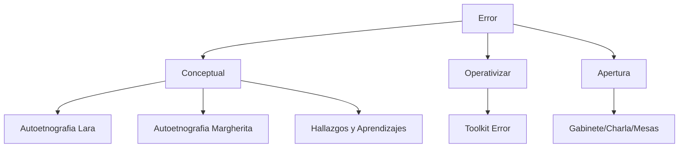

---
{"dg-publish":true,"permalink":"/02-conceptual/error-map-of-content/","created":"2025-11-17T18:48:13.458+01:00","updated":"2025-12-01T17:04:40.178+01:00"}
---

> A comprehensive view of all content exploring the concept of Error within the AION project_

## 🎯 Overview

This Map of Content (MOC) connects all materials, reflections, and tools related to **Error** as a conceptual and practical framework in the AION project.

---

## 📖 Conceptual Explorations

### Autoethnographic Narratives

Personal experiences and reflections on error:

- [[02-Conceptual/Error/Autoetnografia-Lara\|Autoetnografia-Lara]] - #autoetnografia #error
- [[02-Conceptual/Error/Autoetnografia-Margherita\|Autoetnografia-Margherita]] - #autoetnografia #error

### Collective Learning

- [[02-Conceptual/Error/Hallazgos-y-Aprendizajes-Error\|Hallazgos-y-Aprendizajes-Error]] - Findings and learnings from tandem work #error

---

## 🛠️ Practical Applications

### Tools & Methods

- [[05-Operativizar/Toolkit-Error\|Toolkit-Error]] - Operational tools for working with error #toolkit #error

---

## 🎭 Open Sessions & Outcomes

Error emerged and was discussed in these apertura sessions:

- [[03-Apertura/Gabinete-de-Resultados\|Gabinete-de-Resultados]] - Results cabinet #apertura
- [[03-Apertura/Charla-Resumen\|Charla-Resumen]] - Summary talk #apertura
- [[03-Apertura/Mesas-de-Conclusiones\|Mesas-de-Conclusiones]] - Conclusion tables #apertura
- [[03-Apertura/Ordenacion-y-Contraste\|Ordenacion-y-Contraste]] - Organization and contrast #apertura

---

## 🔄 Cross-References

**Related concepts:**

- [[02-Conceptual/Incertidumbre - Map of Content\|Incertidumbre - Map of Content]] - Explore the relationship between Error and Uncertainty
- [[04-Intermedios/Intermedios\|Intermedios]] - Process reflections connecting error themes

**Key themes emerging from Error:**

- Learning through mistakes
- Productive failure
- Error as methodology
- [Add your emerging themes here]

---

## 📊 Visual Overview

mermaid

---

## 📝 Quick Notes

_Use this space for quick connections, questions, or insights:_

---

**Tags:** #MOC #error #overview

**Last Updated:** [Date]
