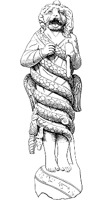

---
{"dg-publish":true,"permalink":"/aion/sobre/","title":"Sobre AION","pinned":true,"created":"2025-11-24T20:33:55.875+01:00","updated":"2025-12-01T17:03:42.902+01:00"}
---

_Aion (del grec aiṓn, ‘eternitat, existència’) és una deïtat hel·lenística, considerada déu suprem i imparcial del temps etern i de la prosperitat, sense començament ni final: l’esdevenir còsmic i les grans transformacions universals. Designa un temps qualitatiu, transcendental i infinit, en contrast amb Chronos, vinculat al temps lineal i quantificable._

{style="display: block; margin: 0 auto; width: 100px;"}

AION: #error i #incertesa en recerca de frontera és un programa pilot de recerca experimental entre artistes i científics que busca superar els contorns disciplinaris i incorporar friccions conceptuals i metodològiques provinents de sistemes de coneixement diversos. El programa obre altres espais per a la confluència entre el coneixement epistèmic i estètic, sensible i racional, material i abstracte, assumint les diversitats com a motors de recerca a la pràctica transdisciplinària.

> La recerca frontera és una pràctica que explora els límits del coneixement existent, impulsada per la curiositat, el risc intel·lectual i la recerca d’avenços fonamentals — és un espai lliure de pressions comercials o instrumentals immediates. Es desenvolupa sovint en espais d’intersecció entre disciplines o en camps emergents, i es caracteritza per una absència de predefinicions i una obertura a la incertesa i a l’error com a motors d’experimentació, creació i descoberta.      La recerca de frontera no només se situa en els límits del que sabem, sinó també en com ho sabem i els marcs epistemològics, ètics i metodològics amb què ho abordem. Per això, promou l’assaig i el tempteig, la reconfiguració de llenguatges i procediments, obrint la possibilitat de generar noves formes de conèixer en el contínuum raó - estètica.

El pilot se centra en dues [[AION/Esferes/esferes|esferes]]: l' [[AION/Esferes/Error/error|error]] (com a element ambivalent que es pot transformar en aliment inesperat) i la [[AION/Esferes/Incertesa/incertesa|incertesa]] (com a condició comuna que permet sostenir-nos en el llindar entre allò que sabem i allò que encara ignorem). Tots dos són punts de partida per generar condicions de possibilitat en la producció de nou coneixement transdisciplinari.

En aquesta primera edició del programa, els tàndems residents estan formats pel [[AION/collaboradores#Markus Teller|Markus Teller]], científic de l'Institut de Ciències Fotòniques (ICFO), i l'artista i investigador [[AION/collaboradores#Pedro Torres|Pedro Torres]] i, per altra banda, per la investigadora de l'Institut de Bioenginyeria de Catalunya (IBEC) [[AION/collaboradores#Margherita Gallano|Margherita Gallano]], i l'artista i recercaire [[AION/collaboradores#Lara Campos|Lara Campos]]. Juntes s'embarquen en un experiment compartit on, des de la pràctica i l'observació, exploraran la incertesa i l'error com a motors de generació de coneixement en la recerca de frontera amb l'objectiu de desenvolupar un corpus de saber que pugui traduir-se en protocols, metodologies o eines de treball per a la recerca híbrida. AION es constitueix com un procés de recerca que integra diverses [[AION/01-material|capes]]. 

A través d’una #metodologia experimental, els dos tàndems desenvolupen un treball autònom alhora que col·lectiu. Ho fan a través d’una recerca conceptual inicial, una autoetnografia, visites als laboratoris i espais de treball, i sessions de diàleg conjunt. D’altra banda, obrim el [[AION/Procés 2025/proces-2025|procés]] per incorporar aportacions i mirades d’altres persones vinculades a la recerca en l’àmbit ACTS en el nostre context proper. Tot el procés compta amb l’acompanyament d'[HacTe](https://www.hactebcn.org/es/) i el sociòleg [Andreu Belsunces Gonçalves](https://andreubelsunces.net/).

AION té el suport del Departament de Cultura de la Generalitat de Catalunya i les complicitats dels membres d’HacTe: [BIST](https://bist.eu/) (Barcelona Institute of Science and Technology), [ICFO](https://www.icfo.eu/ca/) (Institut de Ciències Fotòniques), [IBEC](https://ibecbarcelona.eu/ca/) (Institut de Bioenginyeria de Catalunya) i [Hangar](https://hangar.org/ca/), Centre de producció i recerca artística.
