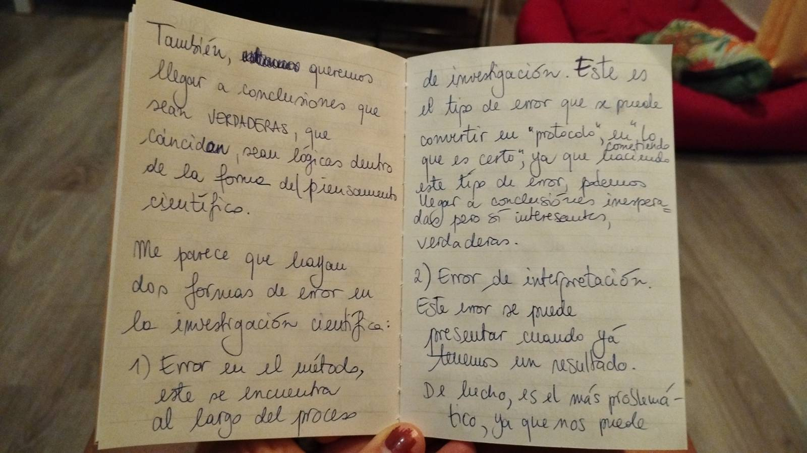
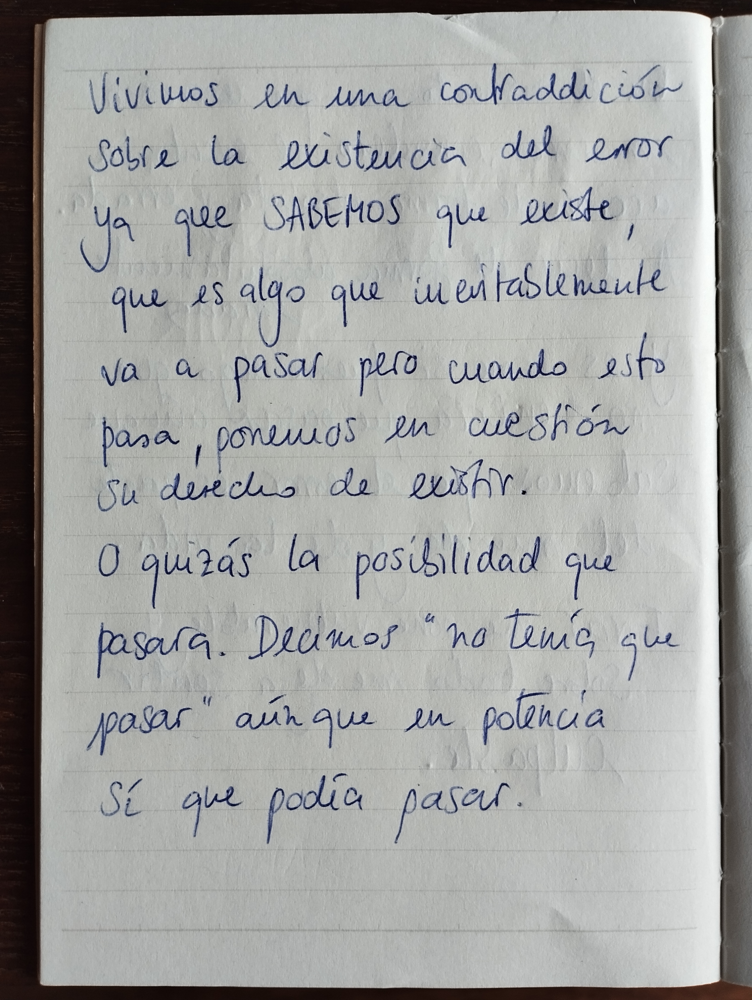
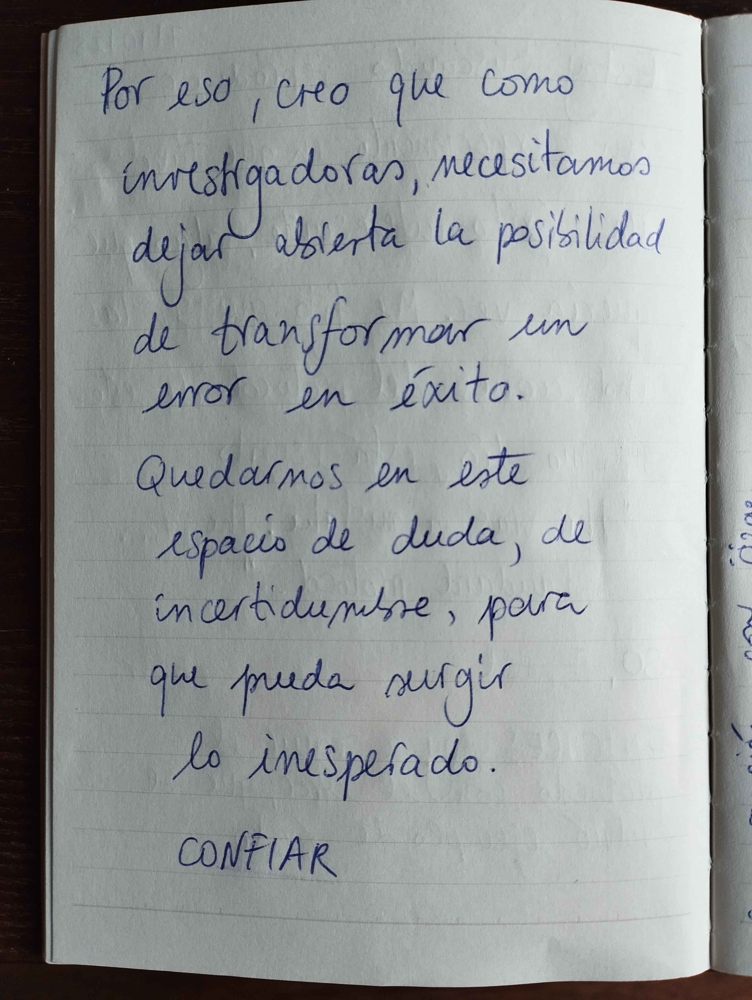

---
{"dg-publish":true,"permalink":"/aion/esferes/error/autoetnografia/margherita/","title":"Autoetnografia Margherita Gallano","created":"2025-11-17T18:34:52.695+01:00","updated":"2025-12-01T17:03:50.619+01:00"}
---

Errar es la única forma de acceder a lo desconocido. 

La investigación científica es intrínsecamente una exploración de lo que no sabemos, no entendemos y todavía no hemos observado. Así que, en mi trabajo cotidiano como investigadora científica el #error es necesario: es una herramienta para viajar la incertidumbre del camino de investigación. Hay una dimensión emotiva importante que influye en la manera cómo lidiamos con el error. En el momento en que reconozco un error, juzgo el evento y las acciones que me han llevado hasta allí de forma absoluta y negativa; es decir, de forma absolutamente negativa. Al observar y distanciarme de la experiencia personal, me sorprende ver que vivo este momento como si fuera algo que no tendría que pasar, aunque sabemos que el error hace parte de la práctica de investigación y de la vida. Errar me vuelve vulnerable y, sobre todo, me hace sentir culpable. 

Distinguir lo que es un error de lo que es correcto, es un juicio que solo se puede hacer a posteriori. Aunque queramos definir después el éxito de un experimento, siempre hay un grado de incertidumbre sobre nuestra interpretación. Por ello, creo que como investigadoras necesitamos dejar abierta la posibilidad de releer un resultado desde una perspectiva diferente y, así,  aprender a quedarnos en un espacio de duda que posibilite el error. Tener la certeza que vamos a errar y ser honestas con nosotras mismas respecto a esta posibilidad nos permite reconocer y transformar un error en un éxito. Solo así puede surgir lo inesperado, podemos liberarnos de los límites impuestos por nuestra ignorancia y construir nuevas hipótesis. 

Pienso en la cuestión de formular hipótesis en el método científico. Necesitamos imaginar; queremos partir de una idea para poder empezar el viaje. Creo que es imprescindible, mientras viajamos, detenerse a revisar la hipótesis inicial, ya que puede revelarse errada o desviarnos de caminos quizá más interesantes. El mismo experimento que yo defino como un fracaso, ya que no me lleva a lo esperado, es igualmente un resultado, es verdadero y puede convertirse en un éxito si cambiamos nuestra perspectiva. Escuché en un seminario que todo lo que pasa en un experimento de biología es correcto. Puede ser algo que nos guste más o menos, pero sí, es correcto, ya que las moléculas funcionan como su naturaleza lo impone. 

Estoy tratando de reproducir un experimento en el que obtuve un resultado interesante, algo que coincidió con mis hipótesis. Me fijo en las anotaciones del protocolo de ese mismo día, escribí: “Este paso fue un error: el protocolo estándar preveía un tiempo de incubación diferente”. Entonces, voy a seguir el protocolo igual como lo hice el día que salió bien, y ya puedo rebautizar el error como éxito. 

Me encuentro pensando en otro tipo de error que cometí. Me olvidé de tomar unas imágenes de mi muestra. Ahora me faltan. Queda un vacío y ya no hay la posibilidad de reinterpretar, de aprovechar  esta muestra, de repensar caminos. Solo puedo parar y repetir el mismo experimento, tomando las imágenes que me faltan. 

Desde la dimensión emotiva del error, sigo pensando en la dimensión interpersonal, es decir, la comunicación del error. El trabajo científico es tan lindo porque es un trabajo de equipo y nos lleva a discutir constantemente, compartiendo resultados, ideas y fallos. Me parece que el error es descuidado en la comunidad científica y que muchas veces se trata como un tabú. Creo que, a largo plazo, este hábito nos lleva a más y mayores errores. El error se magnifica si está escondido, se nutre de vergüenzas y silencios hasta que explota, creando incomodidades y acusaciones.

  

---

  
  
  

  &times;
  &#10094;
  
  &#10095;

  

---

[[AION/Esferes/Error/Autoetnografies/lara|← Autoetnografía Lara Campos]] | [[AION/Esferes/Error/n-caleg|n-Càleg Error →]]

 