---
{"dg-publish":true,"permalink":"/aion/proces-2025/laboratori/","title":"Laboratori"}
---

El 6 de novembre de 2025, Hangar va acollir la segona obertura del programa, una nova capa conceptual al procés de recerca col·laborativa.

La sessió va comptar amb la xerrada _“La creativitat com a indisciplina”_ a càrrec d’Agustí Nieto-Galán, catedràtic d’Història de la Ciència i investigador “ICREA Acadèmia” (2009, 2018, 2023) a la Universitat Autònoma de Barcelona (UAB), qui ha escrit extensament sobre la història de la ciència en els segles XVIII-XX, la història urbana de la ciència i l’anàlisi històrica de les relacions entre ciència i política al segle XX. Recentment acaba d’editar un volum col·lectiu sobre la construcció de la ignorància (agnotologia) a l’Espanya del segle XX. 

En la seva intervenció, Nieto-Galán va donar exemples de teòrics que s’han situat en espais disciplinars liminals, a vegades ambigus o rebels: des dels cercles esotèrics i exotèrics de Ludwik Fleck, la teoria dels paradigmes de Thomas Kuhn, o el concepte de _Boundary-work_ de Thomas Gieryn. Durant la seva intervenció, també va fer referència a la biòloga Rachel Carson i la filòsofa Sandra Harding. La xerrada va posar en valor aquelles pràctiques i pensadors que s’han situat en els límits del coneixement; com la negociació disciplinar és definidora dels marges de la ciència; la necessitat de posar en diàleg coneixement expert i no expert i aprendre a navegar les fronteres d’allò considerat correcte o incorrecte; el paper dels activismes i les resistències com a espais de negociació i creativitat, o la complexitat que emergeix quan les disciplines es dilueixen…

**Conclusions**

Posteriorment, es va obrir un espai per pensar col·lectivament sobre com operativitzar l’#error i la #incertesa, i sobre com ambdós elements poden esdevenir eines metodològiques i creatives. Un exercici complex que va posar sobre la taula moltes preguntes, noves idees i reflexions recurrents que van nodrint el corpus de coneixement en el procés de recerca: la negociació de les temporalitats; qui i com es defineixen els errors; la serendipitat, la ineficàcia i la ineficiència; les materialitats que es generen i que es necessiten per operar amb aquests motors; el component relacional de l’error i la incertesa o la necessitat de generar espais per compartir i incentivar la incertesa, entre d’altres.

Han participat en aquesta sessió: Markus Teller, Margherita Gallano, Pedro Torres, Lara Campos, Tere Badia, Agustí Nieto-Galán, Guillem Serrahima Andrea Olmedo, Núria Vallès, Zoila Babot, Colectivo Juan de Madre, Jara Rocha, Monica Rikic, Lydia Sanmartí, Markel Cormenzana, Blanca Buendia, Daniel Pitarch, Pau Artigas, Monica Seglar, Clara Laguillo, Tatiana Afanador, Antonio Gagliano, Joan Guillem Mayans, Andreu Belsunces, Laia Allegro, Anna Pinotti.

<a href="../../../pdf/la-creatividad-de-la-indisciplina.pdf" target="_blank" class="pdf-download-btn">Descarrega La creativitat com a indisciplina (pdf, 3,7 MB)</a>

---

  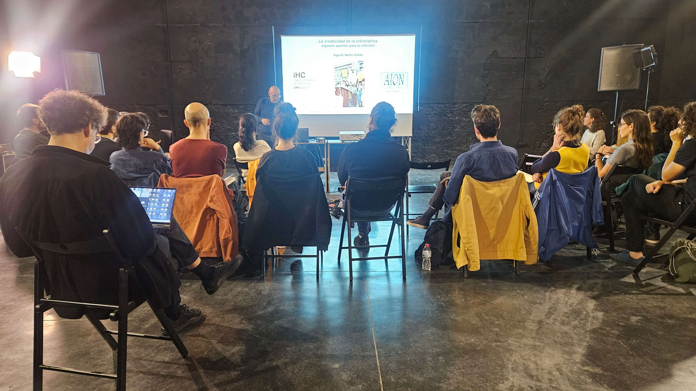
  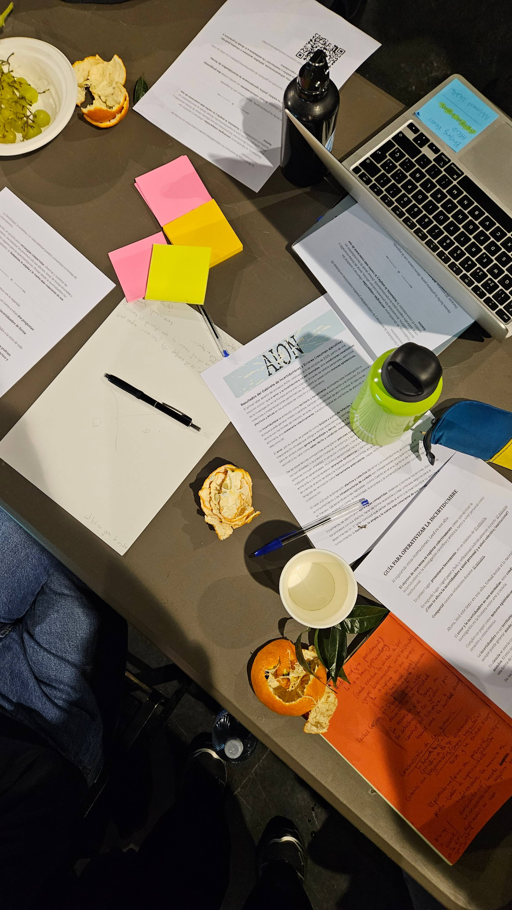
  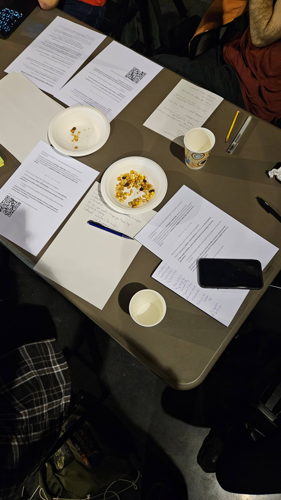
  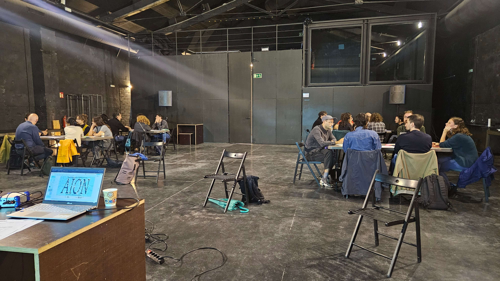
  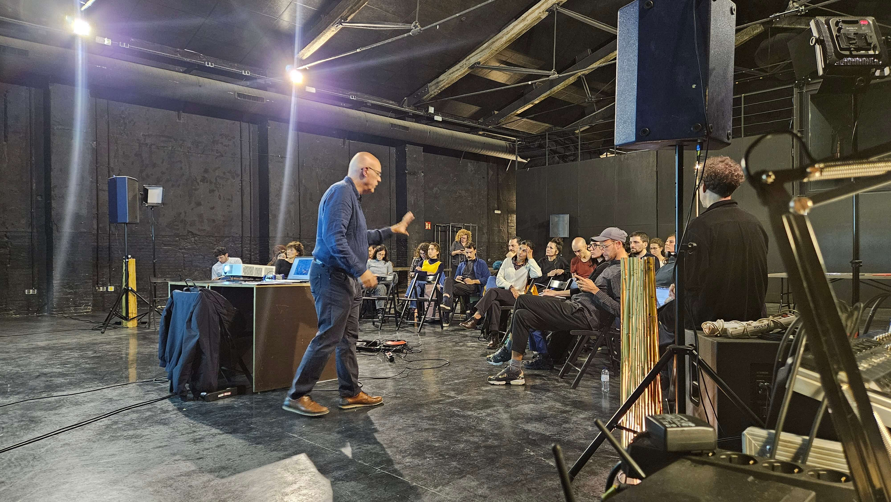
  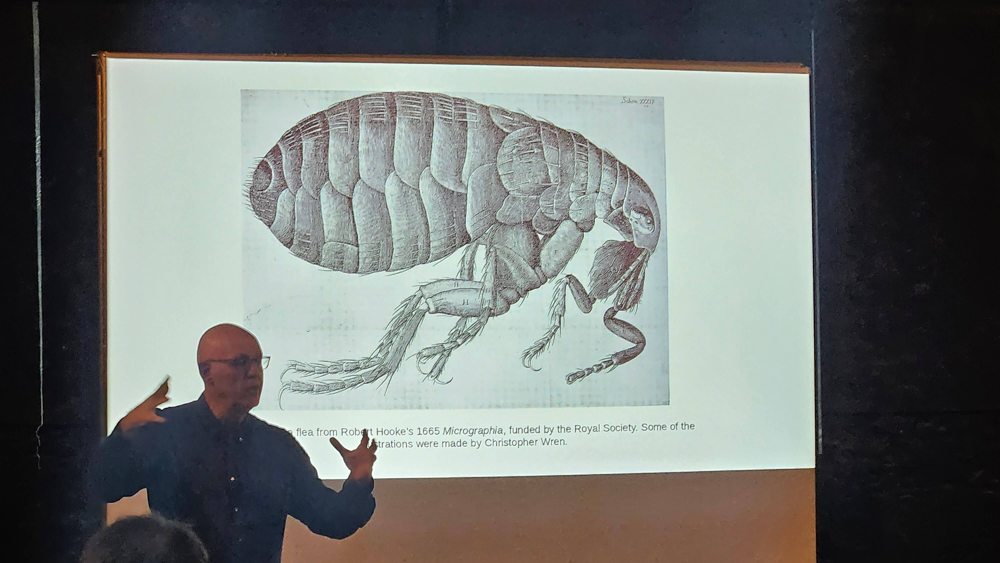
  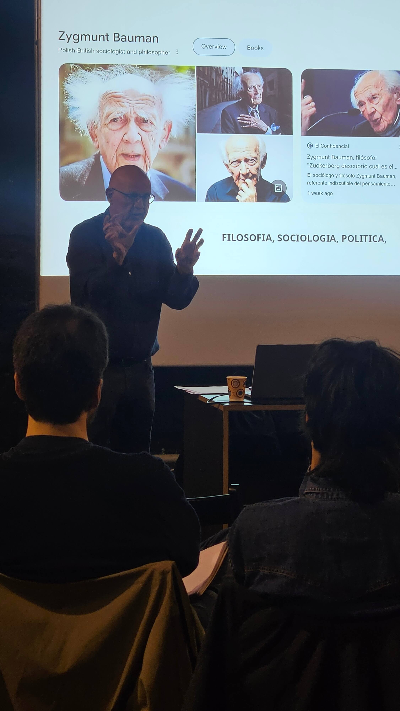
  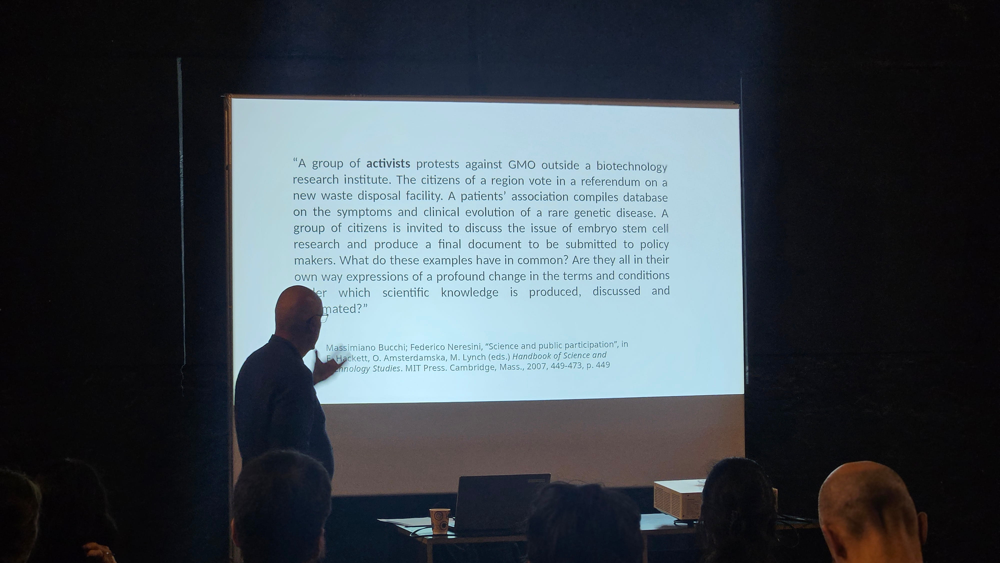
  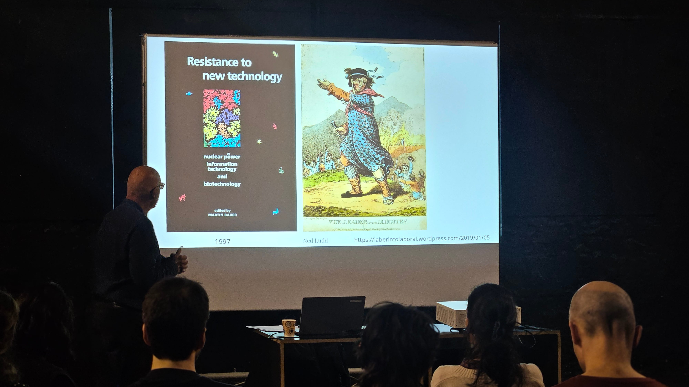
  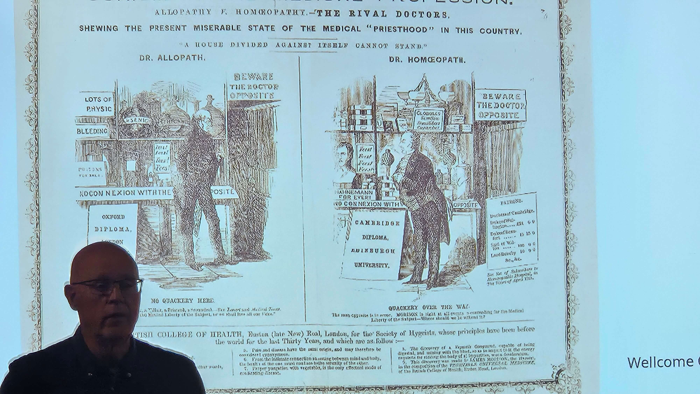
  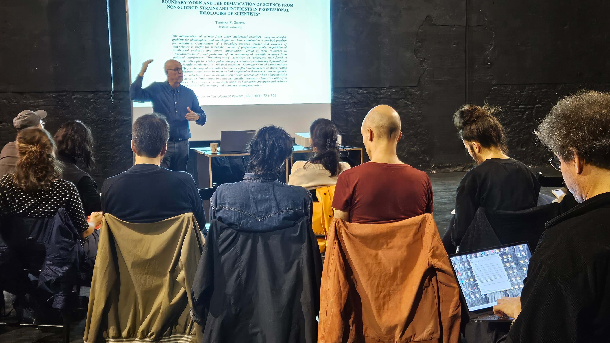
  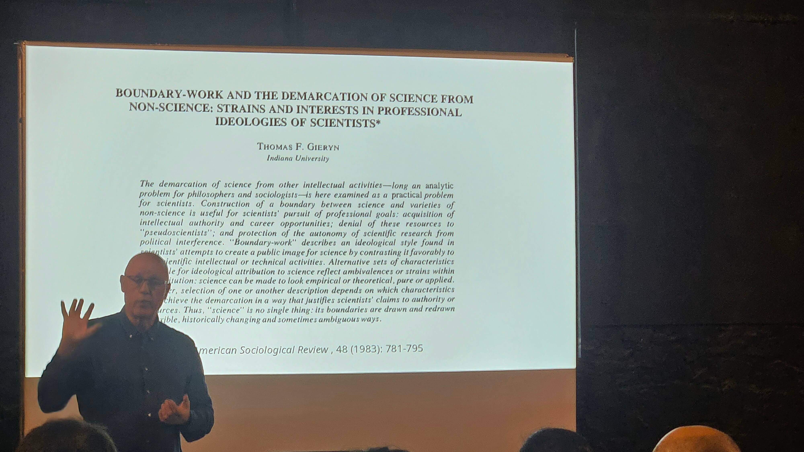
  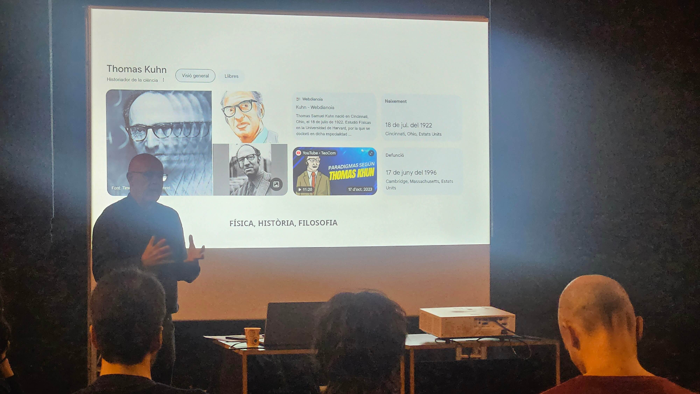
  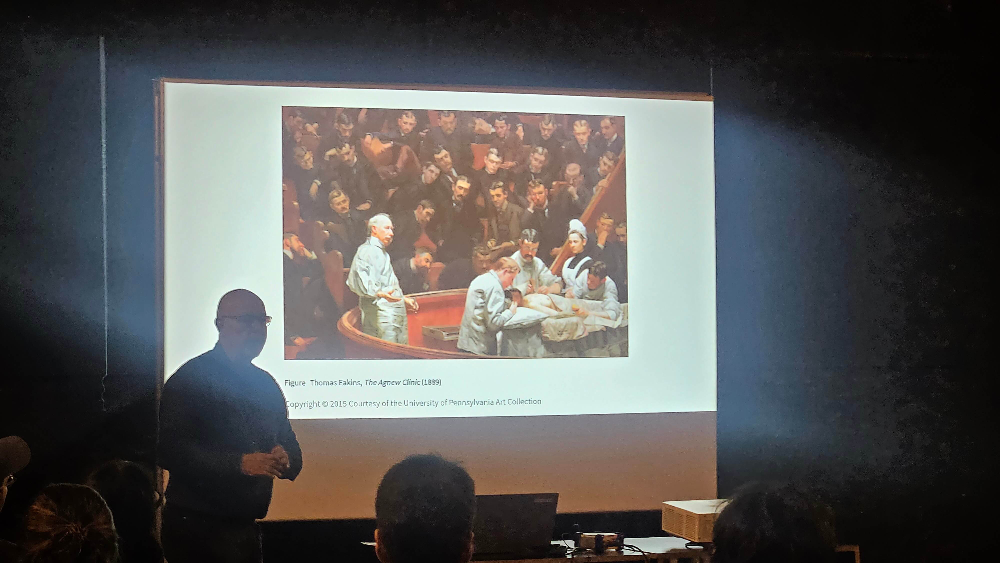
  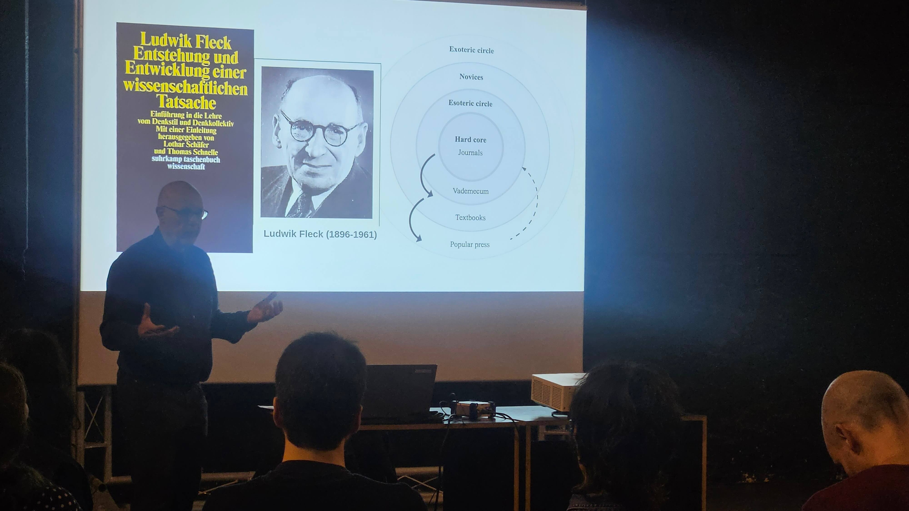
  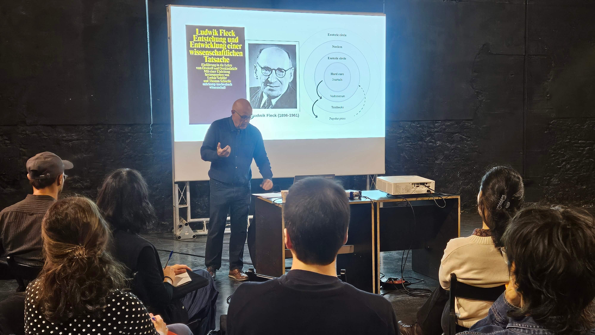
  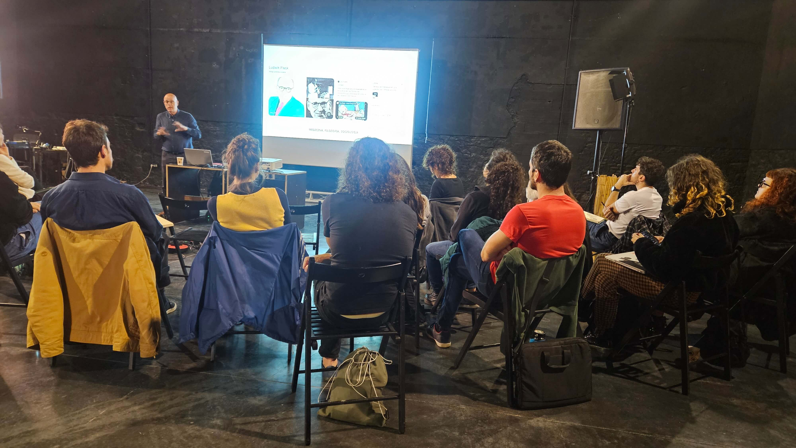

  &times;
  &#10094;
  
  &#10095;

  

---

[[AION/Procés 2025/gabinet\|← Gabinet]] | [[AION/Procés 2025/obrador\|Obrador →]]

