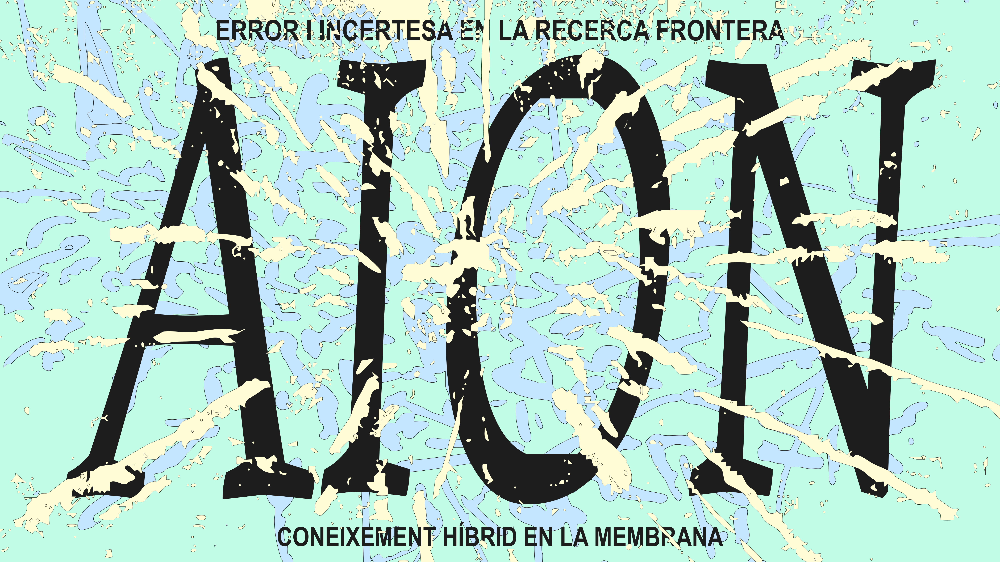

---
{"dg-publish":true,"permalink":"/home/","tags":["gardenEntry"],"created":"2025-11-17T16:59:57.392+01:00","updated":"2025-12-03T12:11:59.412+01:00"}
---

Welcome to the HACTE digital garden project digital garden...

...about this digital space...

## Navigate the Project — AION

### [[AION/Conceptual/Error/00 - Error - Map of Content\|Conceptual - Error]]
Explore autoethnographic perspectives on error
- [[AION/Conceptual/Error/Autoetnografia-Lara\|Autoetnografia-Lara]]
- [[AION/Conceptual/Error/Autoetnografia-Margherita\|Autoetnografia-Margherita]]
- [[AION/Conceptual/Error/Hallazgos-y-Aprendizajes-Error\|Hallazgos-y-Aprendizajes-Error]]

### [[AION/Conceptual/Incertidumbre/00 - Incertidumbre - Map of Content\|Conceptual - Incertidumbre]]
Explore autoethnographic perspectives on uncertainty
- [[AION/Conceptual/Incertidumbre/Autoetnografia-Markus\|Autoetnografia-Markus]]
- [[AION/Conceptual/Incertidumbre/Autoetnografia-Pedro\|Autoetnografia-Pedro]]
- [[AION/Conceptual/Incertidumbre/Hallazgos-y-Aprendizajes-Incertidumbre\|Hallazgos-y-Aprendizajes-Incertidumbre]]

### [[AION/Operativizar/Operativizar\|Operativizar]]
Practical toolkits and applications
- [[AION/Operativizar/Toolkit-Error\|Toolkit-Error]]
- [[AION/Operativizar/Toolkit-Incertidumbre\|Toolkit-Incertidumbre]]

### [[AION/Apertura/Apertura\|Apertura]]
Open sessions and collective outcomes
- [[AION/Apertura/Gabinete-de-Resultados\|Gabinete-de-Resultados]]
- [[AION/Apertura/Charla-Resumen\|Charla-Resumen]]
- [[AION/Apertura/Mesas-de-Conclusiones\|Mesas-de-Conclusiones]]
- [[AION/Apertura/Ordenacion-y-Contraste\|Ordenacion-y-Contraste]]

### [[AION/Intermedios/Intermedios\|Intermedios]]
Process reflections and emergent connections

## [[AION/About\|About]]

